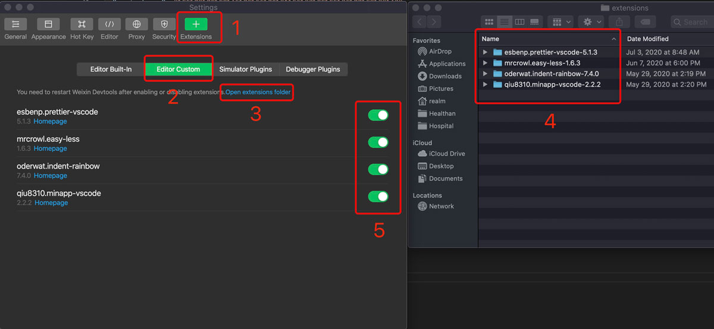
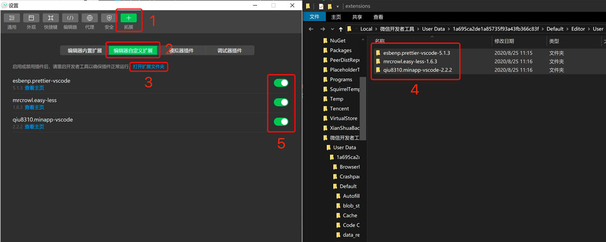
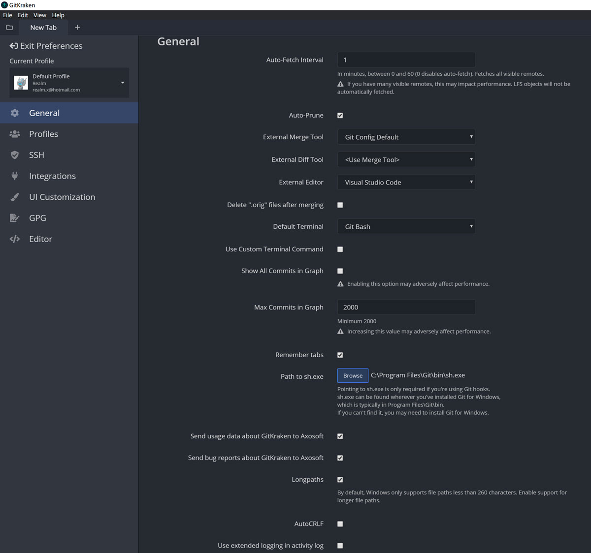
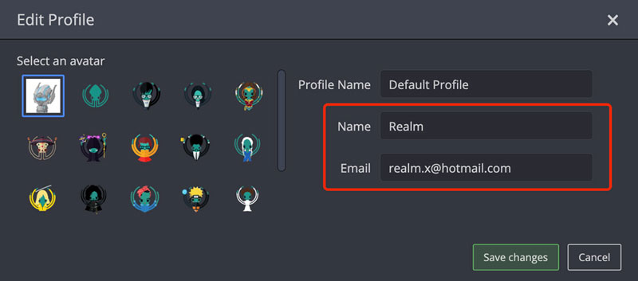
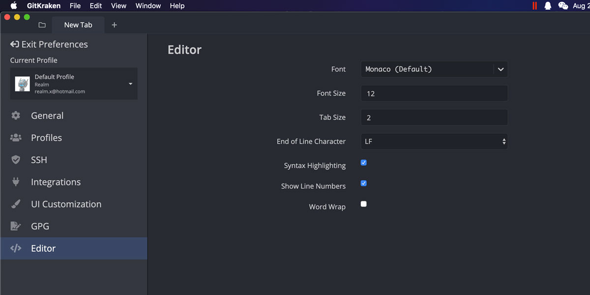
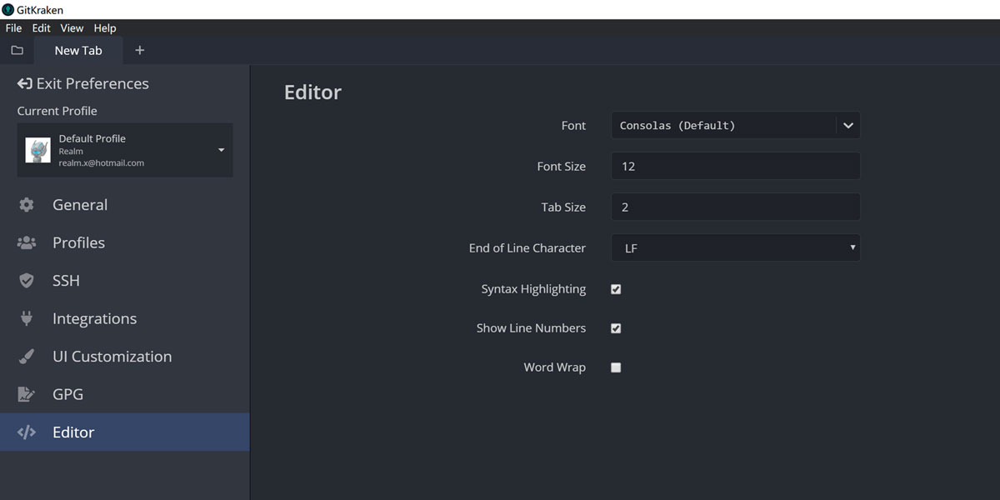

## 工具包管理

- 安装

  | 系统    | 工具                                     |
  | :------ | :--------------------------------------- |
  | Mac     | [Homebrew](https://brew.sh)              |
  | Windows | [Chocolatey](https://www.chocolatey.org) |

## Node

- 安装 Node

  | 系统    | 命令                   | 最新版本                                                          |
  | :------ | :--------------------- | :---------------------------------------------------------------- |
  | Mac     | `brew install node`    |                |
  | Windows | `choco install nodejs` |  |

- 安装 npm 更新工具

  ```shell
  # 通过 npm-check --help 可查询使用方法

  npm install -g npm-check
  ```

## Git

- 安装

  | 系统    | 命令                | 最新版本                                                       |
  | :------ | :------------------ | :------------------------------------------------------------- |
  | Mac     | `brew install git`  |              |
  | Windows | `choco install git` |  |

- 配置

  ```shell
  # 设置用户名
  git config --global user.name '姓名'

  # 设置邮箱
  git config --global user.email '邮箱'

  # 显示颜色
  git config --global color.ui true

  # 提交时把CRLF转换成LF，签出时不转换
  git config --global core.autocrlf input

  # 默认推送当前分支
  git config --global push.default current

  # 拉取远程分支时，是否使用快速合并
  git config --global pull.ff false

  # 拉取远程分支时，是否保持提交曲线为直线
  git config --global pull.rebase true
  ```

- SSH

  - 生成

    ```shell
    # 生成SSH Key，一直默认按回车键确认即可
    ssh-keygen -t rsa -b 4096 -C '建议填写邮箱'

    # 查看并复制公钥
    cat ~/.ssh/id_rsa.pub
    ```

  - 到公司自建 GitLab 上[添加 SSH 密钥](https://gitlab.healthan.net/profile/keys)

## 终端工具

- 安装

  | 系统    | 工具                             | 备注                       |
  | :------ | :------------------------------- | :------------------------- |
  | Mac     | [iTerm2](https://www.iterm2.com) |                            |
  | Windows | `Git Bash`                       | 👈 安装`Git`工具后即可使用 |

- 终端切换

  > 用于 Mac 环境

  | 终端 | 命令                | 备注    |
  | :--- | :------------------ | :------ |
  | zsh  | `chsh -s /bin/zsh`  | 👈 推荐 |
  | bash | `chsh -s /bin/bash` |         |

## VSCode

- 安装[[下载地址](https://code.visualstudio.com/Download)]

- 插件

  | 插件                                                                                                    | 描述                                   | 最新版本                                                                                                                                                                                                                                                                                                                   |
  | :------------------------------------------------------------------------------------------------------ | :------------------------------------- | :------------------------------------------------------------------------------------------------------------------------------------------------------------------------------------------------------------------------------------------------------------------------------------------------------------------------- |
  | [Easy LESS](https://marketplace.visualstudio.com/items?itemName=mrcrowl.easy-less)                      | 通过配置，可实现 less 自动转 wxss 功能 | [](https://marketplace.visualstudio.com/items?itemName=mrcrowl.easy-less) [](https://marketplace.visualstudio.com/items?itemName=mrcrowl.easy-less)                         |
  | [minapp](https://marketplace.visualstudio.com/items?itemName=qiu8310.minapp-vscode)                     | 微信小程序标签、属性的智能补全         | [](https://marketplace.visualstudio.com/items?itemName=qiu8310.minapp-vscode) [](https://marketplace.visualstudio.com/items?itemName=qiu8310.minapp-vscode)         |
  | [Prettier - Code formatter](https://marketplace.visualstudio.com/items?itemName=esbenp.prettier-vscode) | 代码格式化工具                         | [](https://marketplace.visualstudio.com/items?itemName=esbenp.prettier-vscode) [](https://marketplace.visualstudio.com/items?itemName=esbenp.prettier-vscode)     |
  | [Vetur](https://marketplace.visualstudio.com/items?itemName=octref.vetur)                               | Vue 开发的开发工具                     | [](https://marketplace.visualstudio.com/items?itemName=octref.vetur) [](https://marketplace.visualstudio.com/items?itemName=octref.vetur)                                             |
  | [Vue 2 Snippets](https://marketplace.visualstudio.com/items?itemName=hollowtree.vue-snippets)           | 基于最新的 Vue 2 的 API 添加的代码片段 | [](https://marketplace.visualstudio.com/items?itemName=hollowtree.vue-snippets) [](https://marketplace.visualstudio.com/items?itemName=hollowtree.vue-snippets) |

- 配置
  <details>
  <summary>--------------------------------------------- 👉 点击展开 👈 ---------------------------------------------</summary>

  ```json
  {
    "editor.formatOnSave": true,
    "editor.stablePeek": true,
    "editor.tabCompletion": "on",
    "editor.tabSize": 2,
    "editor.wordWrapColumn": 120,
    "editor.minimap.enabled": false,
    "explorer.openEditors.visible": 0,
    "search.exclude": {
      "**/dist": true,
      "**/miniprogram_npm": true
    },
    "files.watcherExclude": {
      "**/dist/**": true,
      "**/miniprogram_npm/**": true
    },
    "files.associations": {
      "*.cjson": "jsonc",
      "*.wxs": "javascript",
      "*.wxss": "css",
      "*.acss": "css",
      "*.axml": "wxml",
      "*.wpy": "vue"
    },
    "emmet.includeLanguages": {
      "wxml": "html"
    },
    "[wxml]": {
      "editor.defaultFormatter": "qiu8310.minapp-vscode"
    },
    "[axml]": {
      "editor.defaultFormatter": "qiu8310.minapp-vscode"
    },
    "[css]": {
      "editor.defaultFormatter": "esbenp.prettier-vscode"
    },
    "[less]": {
      "editor.defaultFormatter": "esbenp.prettier-vscode"
    },
    "[javascript]": {
      "editor.defaultFormatter": "esbenp.prettier-vscode"
    },
    "[json]": {
      "editor.defaultFormatter": "esbenp.prettier-vscode"
    },
    "editor.defaultFormatter": "esbenp.prettier-vscode",
    "minapp-vscode.wxmlFormatter": "prettyHtml",
    "minapp-vscode.formatMaxLineCharacters": 120,
    "minapp-vscode.disableAutoConfig": true,
    "minapp-vscode.showSuggestionOnEnter": true,
    "minapp-vscode.prettier": {
      "printWidth": 120,
      "semi": false,
      "singleQuote": true,
      "trailingComma": "none"
    },
    "minapp-vscode.prettyHtml": {
      "printWidth": 120,
      "usePrettier": false,
      "sortAttributes": true
    },
    "prettier.printWidth": 120,
    "prettier.singleQuote": true,
    "prettier.semi": false,
    "prettier.trailingComma": "none",
    "less.compile": {
      "outExt": ".wxss"
    }
  }
  ```

  </details>

## 小程序开发者工具

- 安装[[下载地址](https://developers.weixin.qq.com/miniprogram/dev/devtools/download.html)]

  > 若已安装，建议更新版本至`1.03.2008270`或更高版本

- 插件

  | 插件                                                                                                    | 描述                                   | 最新版本                                                                                                                                                                                                                                                                                                               |
  | :------------------------------------------------------------------------------------------------------ | :------------------------------------- | :--------------------------------------------------------------------------------------------------------------------------------------------------------------------------------------------------------------------------------------------------------------------------------------------------------------------- |
  | [Easy LESS](https://marketplace.visualstudio.com/items?itemName=mrcrowl.easy-less)                      | 通过配置，可实现 less 自动转 wxss 功能 | [](https://marketplace.visualstudio.com/items?itemName=mrcrowl.easy-less) [](https://marketplace.visualstudio.com/items?itemName=mrcrowl.easy-less)                     |
  | [minapp](https://marketplace.visualstudio.com/items?itemName=qiu8310.minapp-vscode)                     | 微信小程序标签、属性的智能补全         | [](https://marketplace.visualstudio.com/items?itemName=qiu8310.minapp-vscode) [](https://marketplace.visualstudio.com/items?itemName=qiu8310.minapp-vscode)     |
  | [Prettier - Code formatter](https://marketplace.visualstudio.com/items?itemName=esbenp.prettier-vscode) | 代码格式化工具                         | [](https://marketplace.visualstudio.com/items?itemName=esbenp.prettier-vscode) [](https://marketplace.visualstudio.com/items?itemName=esbenp.prettier-vscode) |

  - 安装与设置

    - 在`VSCode`里先把这些插件安装完成
    - 拷贝指定目录下的插件

      | Mac                                                                                                  | Windows                                                 |
      | :--------------------------------------------------------------------------------------------------- | :------------------------------------------------------ |
      | 打开`Finder｜访达`，按`Command + Shift + G`组合键，输入地址`~/.vscode/extensions/`，复制目录下的插件 | 复制`C:\Users\[帐号名]\.vscode\extensions\`目录下的插件 |

    - 进入插件目录（下图标注 1，2，3）
    - 粘贴插件（下图标注 4）
    - 启用插件（下图标注 5，需重新打开设置才能启用）

      | Mac                                                       | Windows                                                           |
      | --------------------------------------------------------- | ----------------------------------------------------------------- |
      |  |  |

- 配置

  > 需创建或打开项目后才能修改扩展配置

  <details>
  <summary>--------------------------------------------- 👉 点击展开 👈 ---------------------------------------------</summary>

  ```json
  {
    "editor.formatOnSave": true,
    "editor.stablePeek": true,
    "editor.tabCompletion": "on",
    "editor.tabSize": 2,
    "editor.wordWrapColumn": 120,
    "editor.minimap.enabled": false,
    "editor.defaultFormatter": "esbenp.prettier-vscode",
    "editor.fontSize": 12,
    "editor.lineHeight": 0,
    "editor.wordWrap": "off",
    "editor.insertSpaces": true,
    "explorer.openEditors.visible": 0,
    "workbench.editor.enablePreview": true,
    "workbench.editor.enablePreviewFromQuickOpen": true,
    "workbench.editor.showTabs": true,
    "search.exclude": {
      "**/dist": true,
      "**/miniprogram_npm": true
    },
    "files.watcherExclude": {
      "**/dist/**": true,
      "**/miniprogram_npm/**": true
    },
    "files.associations": {
      "*.cjson": "jsonc",
      "*.wxs": "javascript",
      "*.wxss": "css"
    },
    "[wxml]": {
      "editor.defaultFormatter": "qiu8310.minapp-vscode"
    },
    "[css]": {
      "editor.defaultFormatter": "esbenp.prettier-vscode"
    },
    "[less]": {
      "editor.defaultFormatter": "esbenp.prettier-vscode"
    },
    "[javascript]": {
      "editor.defaultFormatter": "esbenp.prettier-vscode"
    },
    "[json]": {
      "editor.defaultFormatter": "esbenp.prettier-vscode"
    },
    "javascript.updateImportsOnFileMove.enabled": "always",
    "minapp-vscode.wxmlFormatter": "prettyHtml",
    "minapp-vscode.formatMaxLineCharacters": 120,
    "minapp-vscode.disableAutoConfig": true,
    "minapp-vscode.showSuggestionOnEnter": true,
    "minapp-vscode.prettier": {
      "printWidth": 120,
      "semi": false,
      "singleQuote": true,
      "trailingComma": "none"
    },
    "minapp-vscode.prettyHtml": {
      "printWidth": 120,
      "usePrettier": false,
      "sortAttributes": true
    },
    "prettier.printWidth": 120,
    "prettier.singleQuote": true,
    "prettier.semi": false,
    "prettier.trailingComma": "none",
    "less.compile": {
      "outExt": ".wxss"
    }
  }
  ```

  </details>

## GitKraken

> 非必要工具，可选用其他趁手的工具

- 安装

  |    系统 | 工具                                                                                                                                       |
  | ------: | :----------------------------------------------------------------------------------------------------------------------------------------- |
  |     Mac | [GitKraken](https://release.gitkraken.com/darwin/installGitKraken.dmg)                                                                     |
  | Windows | GitKraken [64bit](https://release.gitkraken.com/win64/GitKrakenSetup.exe)，[32bit](https://release.gitkraken.com/win32/GitKrakenSetup.exe) |

- 登录

  > 免费版无法长期使用私有仓库  
  > 找【 技术经理 】解决帐号密码登录问题  
  > 若自行购买授权，需要支持美元支付的卡【`VISA` 和 `MASTERCARD`】

- 配置

  - General

    |                      Mac                      |                        Windows                        |
    | :-------------------------------------------: | :---------------------------------------------------: |
    |  |  |

  - Profile

    

  - Editor

    |                     Mac                     |                       Windows                       |
    | :-----------------------------------------: | :-------------------------------------------------: |
    |  |  |
